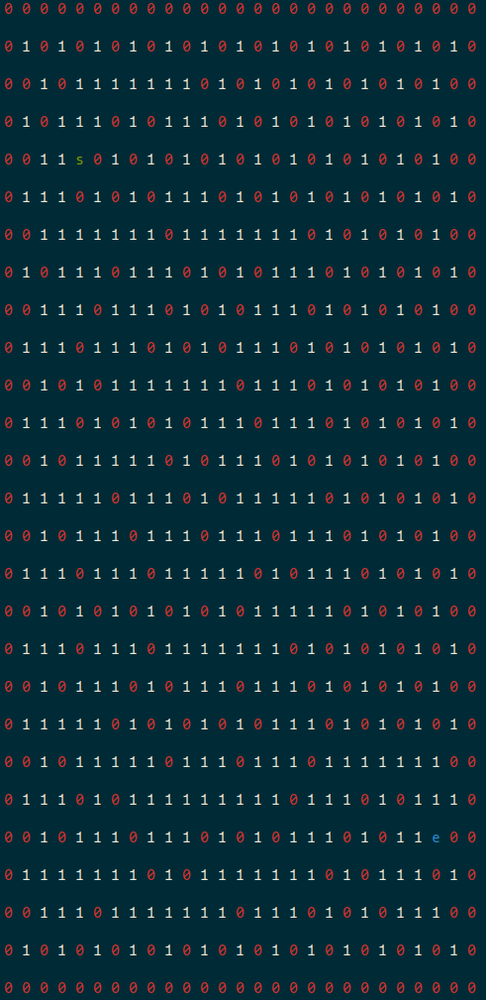

# Maze Solver for MAIS Hack

This program randomly generates a square maze with random start and end point. An AI is used to solve that maze.



## Installation
```
git clone https://github.com/eli0009/maze-solver
pip3 install colorama
```

## Usage
```
python3 maze_solver.py
```